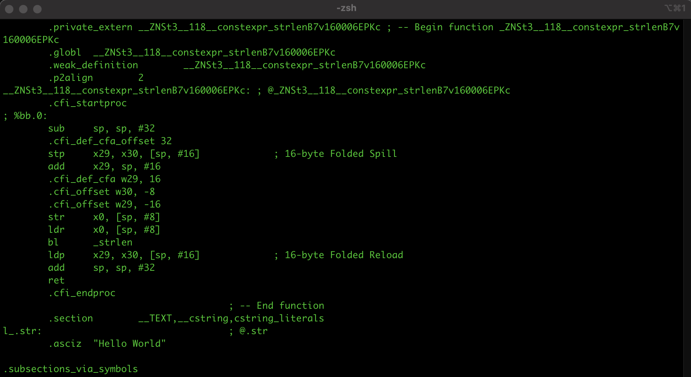

## Introduction

C++ was indeed created by Bjarne Stroustrup in 1979 as an extension of the C programming language. The first commercial implementation of C++ was released in 1985.

The GNU Compiler Collection (GCC) was first released in 1987 as part of the GNU Project, which was initiated by Richard Stallman in 1983. The goal of the GNU Project was to create a free Unix-like operating system composed entirely of free software.

Before the creation of GCC, C++ programs were typically compiled using proprietary compilers provided by hardware vendors or software companies, which made it challenging for developers to write and distribute C++ programs across different systems.

While the GNU Project initially aimed to develop the GNU Hurd kernel as part of its operating system, the widespread adoption of the Linux kernel led to the integration of many GNU components, including GCC, the GNU C Library, and core utilities, into Linux-based operating systems.

GCC is a portable compiler, runs on most of platforms available today, produces output for many types of processors (x86_64, ARM, aarch64...).

GNU GCC is distributed under GNU GPL license (GNU General Public License), which means free to use, modify.

## Compiling a C/C++ program

Compilation is a multi-stage process involving several tools, including the GNU Compiler itself (through the gcc or g++ frontends), the GNU Assembler as, and the GNU Linker ld. The complete set of tools used in the compilation process is referred to as a toolchain.


The sequence of commands executed by a single invocation of GCC consists of the following
stages:
- preprocessing (to expand macros)
- compilation (from source code to assembly language)
- assembly (from assembly language to machine code)
- linking (to create the final executable)

Let's say we have a sample C++ program source code: [https://github.com/nguyenchiemminhvu/CPP_Build_Automation/tree/master/GNU_GCC/SampleProjects/01_HelloWorld](https://github.com/nguyenchiemminhvu/CPP_Build_Automation/tree/master/GNU_GCC/SampleProjects/01_HelloWorld)

To perform the preprocessor stage, execute the following GCC command:

```
g++ -E main.cpp -o main.i
```

The result is main.i file output which contains the source code with all macros expanded.

The next stage of the process is the actual compilation of preprocessed source code to assembly language.

```
g++ -S main.i -o main.s
```

The resulting assembly language is stored in the main.s file. Here is how assembly language for an ARM64 processor looks like:



In the next stage, the assembler tool is used to convert assembly language into machine code and generate object files. When there are calls to external functions in the assembly source file, the assembler tool leaves the address of the external functions undefined, will be filled later in the linking stage.

```
as main.s -o main.o
```

The resulting file main.o contains the machine instructions for the compiled C/C++ program, with undefined reference to the external function calls.

```
ld main.o -L/usr/lib -lstdc++ -o main
# or
g++ main.o -o main
```

When using ld command, it knows nothing about C++ or any other programming language. So we must specify the path and library name for it. While it is easier to use GNU GCC linking because it know where the libraries are located in the current system.

```
#!/bin/bash

if [ $# -eq 0 ]; then
    # No argument provided, compile the C++ program
    g++ -E main.cpp -o main.i
    g++ -S main.i -o main.s
    as main.s -o main.o
    #ld main.o -L/usr/lib -lstdc++ -o main
    g++ main.o -o main
elif [ "$1" = "clean" ]; then
    # Argument is "clean", perform clean operation
    rm -f main.i main.s main.o main
    echo "Clean operation complete"
else
    echo "Unknown argument"
fi
```

The bash script above demonstrate the whole compilation process to create the executable file from a C++ source file.

In real life practice, we often rely on the g++ compiler tool to handle the compilation process for us. The g++ compiler is a powerful tool that can simplify the steps involved in compiling and linking C++ programs. When using g++ as a command-line tool, we can compile and link our C++ programs with a single command. For example, instead of going through the individual steps mentioned in the script, we can achieve the same result with a single command:

```
g++ main.cpp -o main
```

This command compiles the main.cpp file and links it to create the final executable main. By default, g++ performs the preprocessing, compilation, assembly, and linking steps for us. It also automatically links the necessary standard C++ libraries.

### Compiling multiple source files

### Compiling files independently
#### Creating object files from source files

#### Creating executables from object files

### Using more compilation options
#### Adding search paths

#### Adding environment variables

#### Using preprocessors

#### Compiling for debugging

## Compiling a C/C++ library

### Compiling static library and link to C/C++ program

### Compiling shared object (dynamic library) and link to C/C++ program

## A sample project

